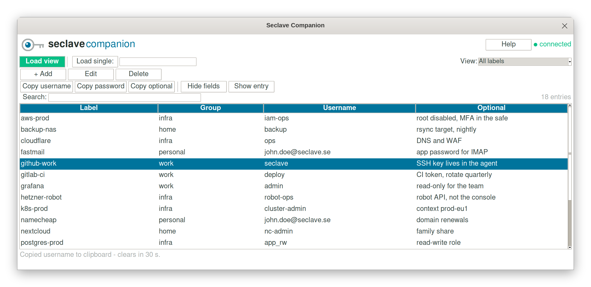

# Seclave Companion

A desktop table view for a Seclave 2.0 hardware password manager, over the
device's USB-slave (CDC-ACM serial) protocol. It lists the entries stored on the
device in a searchable, sortable table and lets you copy a username or password,
add an entry, edit one, or delete one - each secret action confirmed on the
device's own screen.

It is one self-contained Python file using only the standard library: no pip
installs, no background service, and nothing written to disk. The real security
boundary is the Seclave itself - its display and joystick, where you see and
approve each action. This app is a convenience front-end.

## Installation

Prebuilt packages for each release are on the
[Releases](https://github.com/seclave/seclave-companion/releases) page, with a
`SHA256SUMS.txt` to check them against.

### Linux

Install the package for your distribution:

```
sudo apt install ./seclave-companion_<version>_all.deb     # Debian/Ubuntu
sudo dnf install ./seclave-companion-<version>.noarch.rpm  # Fedora/RHEL
```

It installs `seclave_companion` on your PATH, a desktop menu entry, and a udev
rule that keeps ModemManager off the port (it otherwise probes the new serial
device and can corrupt the first exchange), grants the logged-in user access with
no group setup, and creates a stable `/dev/seclave` symlink. Plug the device in,
put it in USB-slave mode, run `seclave_companion`.

### Windows

Download `SeclaveCompanion-Setup-<version>.exe` and run it. It installs into
`Program Files\Seclave\Seclave Companion` with a Start menu entry, and needs no
Python.

Two alternatives ship alongside it: `SeclaveCompanion-<version>-portable.zip`
unpacks into a folder you can run from anywhere (including a USB stick), and
`SeclaveCompanion-<version>-console.exe` is the same program with a console
attached, for when you want to see what it is doing.

### macOS

There is no macOS package yet. Install Tk and put the single file on your PATH:

```
brew install python-tk
sudo install -m 755 seclave_companion.py /usr/local/bin/seclave_companion
```

Then run `seclave_companion`. `/usr/local/bin` is on the default PATH and is not
protected by SIP, so it is the right home for a hand-installed tool. The file's
shebang picks whichever `python3` comes first on your PATH - make sure that is
Homebrew's, because Apple's system Python has no usable Tk.

### pip or uv (any platform)

If you have pipx or uv, this installs the `seclave_companion` command on your
PATH:

```
pipx install seclave-companion        # or: uv tool install seclave-companion
seclave_companion
```

`pip install seclave-companion` into a virtualenv works too. The Python running
it must have Tk: python.org installers include it, uv's managed Pythons include
it, Homebrew needs `brew install python-tk`, and Debian/Ubuntu needs
`sudo apt install python3-tk`. On Linux you still need serial access - install
the udev rule described below; on macOS and Windows the port works as-is.

## Running from source

The program is a single file needing only the standard library and Tk, so a
checkout runs as-is on Python 3.9 or later:

```
python3 seclave_companion.py
```

Install Tk first if your Python does not have it:

- Debian/Ubuntu: `sudo apt install python3-tk`
- Fedora: `sudo dnf install python3-tkinter`
- Arch: `sudo pacman -S tk`
- macOS: `brew install python-tk`
- Windows: use the python.org installer, which includes Tk, then
  `py seclave_companion.py`

Running from source you handle serial access yourself: add your user to the
`dialout` group, or install the packaged udev rule
(`packaging/linux/60-seclave.rules`) by hand.

## Before you start



Put the device in USB-slave mode: on the Seclave, open the menu and select
**Usb slave**. The serial port exists only while the device sits in that menu,
so leaving it (or pressing UP) disconnects the app. Then:

1. **Load view** lists your entries. Confirm "Show all labels" on the device.
2. Select a row and click **Show entry** to read it. Confirm the reads on the
   device; every field then appears in a read-only window, password masked
   until you tick "show", and stays filled in on the table afterwards.
3. **Copy username**, **Copy password** and **Copy optional** put one value on
   the clipboard. It clears after 30 seconds, and on exit.
4. **+ Add**, **Edit** and **Delete** change entries, each confirmed on the
   device. In the dialog, the **8 / 12 / 16 / 20** buttons beside the password
   field generate one of that length. A save that is declined or fails keeps
   everything you typed, so a rejected save cannot lose an entry.
5. **Search** filters as you type. Click a column header to sort by it, again
   to reverse, a third time to return to the device's own order.
6. **Load single** fetches one entry by label, when you would rather not list
   everything. Adding, editing and deleting work from there too.
7. The **View** dropdown switches to **Web passwords (wwwfill)**, confirmed
   once as "Show all wwwfills". Each view is fetched the first time you show
   it and is instant thereafter.

Good to know:

- Most reads pause until you confirm on the device, with a red "Look at your
  Seclave" bar while it waits. **Stop waiting** gives up on a prompt that is
  not going to be answered.
- How much the device asks is its own setting, under **Admin -> Slave
  security**: **Normal** (the default) and **Ask all** confirm most reads,
  **Allow all** confirms nothing.
- **Hide fields** re-masks the selected row for onlookers. The values stay in
  memory, so showing or copying them again costs nothing, and the button works
  while the device is unplugged.
- Unplugging the device (or leaving the Usb slave menu) clears every revealed
  value back to `•••`. Labels and groups stay, so the table stays navigable.
- If the Group column is still empty after loading, click **Load view +
  groups**. Should the device start asking you to confirm each group, the app
  stops and points you at the access-mode setting rather than prompting you
  once per entry.

## Secrets in memory

Every host-side copy of a secret lives in mmap pages the app zeroes explicitly:
bytes are read from the serial port straight into an anonymous mmap arena (never
into an intermediate Python `bytes`), parsed in place, copied mmap-to-mmap into a
per-secret buffer, and the arena is wiped after every command. Secrets are read
from the device only when you ask for them, and the clipboard clears after 30
seconds and on exit. The two copies the app cannot control are the kernel's tty
receive buffer and the transient string created at the moment a value is shown or
placed on the clipboard (which the clipboard and windowing system may then
retain). The app does not lock pages into RAM, and makes no claim of complete
zeroization - the device's on-screen confirmation, not host memory hygiene, is
what actually protects your secrets.

To report a security issue, see [SECURITY.md](SECURITY.md).

## Contributing

Working on the code, the hardware-free development stubs, the test suite and the
release process are all described in [CONTRIBUTING.md](CONTRIBUTING.md).

## License

MIT - see the [LICENSE](LICENSE) file.

Seclave is a trademark of Seclave AB. This license grants no trademark rights.
